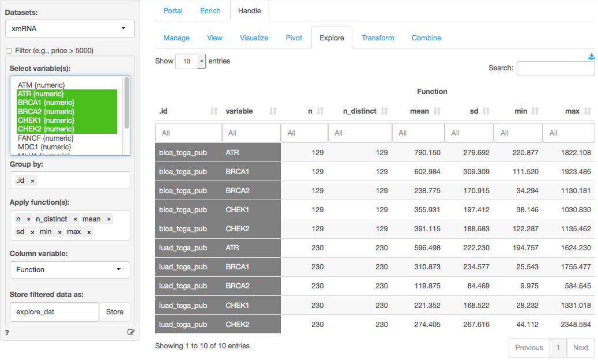

> Summarize and explore your data

Generate summary statistics for one or more variables in your data. The most powerful feature in Explore is that you can easy describe the data _by_ one or more other variables. Where the _Pivot_ tab works best for frequency tables and to summarize a single numerical variable, the _Explore_ tab allows you to summarize multiple variables at the same time using various statistics.

For example, if we select `Genes` from the `xmRNA` dataset we can see the number of observations (n), the mean, the median, etc. etc.

The created summary table can be stored in bioCancer by clicking the `Store` button. This can be useful if you want to create plots using the summarized data. To download the table to _csv_ format click the download icon on the top-right.

You can select options from `Column variable` dropdown to switch between different column headers. Select either the `functions` (e.g., mean, median, etc), the variables (e.g., Genes), or the levels of the (first) `Group by` variable (e.g., Studies).

### Filter

Use the `Filter` box to select (or omit) specific sets of rows from the data. See the helpfile for Data > View for details.
